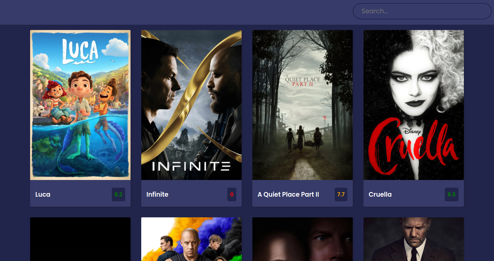

  


<!-- PROJECT LOGO -->
<br />
<p align="center">
  <a href="https://github.com/othneildrew/Best-README-Template">
    
  </a>

  <h3 align="center">Find Your Movie</h3>

  <p align="center">
    Your own movie library to find what you want to watch!
    <br />
    <a href="https://github.com/larissasouto/movies-app"><strong>Explore the docs »</strong></a>
    <br />
    <br />
    <a href="https://movies-app-199a9.web.app/">View Demo</a>
    ·
    <a href="https://github.com/larissasouto/movies-app/issues">Report Bug</a>
    ·
    <a href="https://github.com/larissasouto/movies-app/issues">Request Feature</a>
  </p>
</p>


<!-- TABLE OF CONTENTS -->
<details open="open">
  <summary>Table of Contents</summary>
  <ol>
    <li>
      <a href="#about-the-project">About The Project</a>
      <ul>
        <li><a href="#built-with">Built With</a></li>
      </ul>
    </li>
    <li>
      <a href="#getting-started">Getting Started</a>
      <ul>
        <li><a href="#prerequisites">Prerequisites</a></li>
        <li><a href="#installation">Installation</a></li>
      </ul>
    </li>
    <li><a href="#contributing">Contributing</a></li>
    <li><a href="#license">License</a></li>
    <li><a href="#contact">Contact</a></li>
    <li><a href="#acknowledgements">Acknowledgements</a></li>
  </ol>
</details>


<!-- ABOUT THE PROJECT -->
## About The Project
<p align="center">
  <a href="https://movies-app-199a9.web.app/">
    
  </a>
</p>


This project was developed with the goal of creating a simple web application to find movies to watch. You can search for the movie title, see the synopsis, and the rating for the movie. 

It's a very simple application, but the aim was training my knowledge in ReactJS. Also it's amazing use your time to focus on creating something amazing!

### Built With

This section list the frameworks and tools that was used to build this project:
* [ReactJS](https://reactjs.org/)
* [The Movie DB API](https://www.themoviedb.org/documentation/api)


<!-- GETTING STARTED -->
## Getting Started

This project was bootstrapped with [Create React App](https://github.com/facebook/create-react-app).

#### Available Scripts

In the project directory, you can run:

### `yarn start`

Runs the app in the development mode.<br />
Open [http://localhost:3000](http://localhost:3000) to view it in the browser.

The page will reload if you make edits.<br />
You will also see any lint errors in the console.

### Prerequisites

To run this project you'll need only the npm, and you also can use <a href="https://yarnpkg.com/getting-started">yarn</a>.

* yarn  
  ```sh
  npm install -g yarn
  ```

### Installation

1. Get a free API Key at [themoviedb.org](https://www.themoviedb.org/documentation/api)
2. Clone the repo
   ```sh
   git clone https://github.com/your_username_/Project-Name.git
   ```
3. Install NPM packages
   ```sh
   npm install
   ```
4. Enter your API in `App.js`
   ```JS
   const FEATURED_API = 'ENTER YOUR API';
   const SEARCH_API = 'ENTER YOUR API';
   ```

<!-- CONTRIBUTING -->
## Contributing

Contributions are what make the open source community such an amazing place to be learn, inspire, and create. Any contributions you make are **greatly appreciated**.

1. Fork the Project
2. Create your Feature Branch (`git checkout -b feature/AmazingFeature`)
3. Commit your Changes (`git commit -m 'Add some AmazingFeature'`)
4. Push to the Branch (`git push origin feature/AmazingFeature`)
5. Open a Pull Request

<!-- LICENSE -->
## License

Distributed under the MIT License. See `LICENSE` for more information.


<!-- CONTACT -->
## Contact

Larissa Souto - [Linkedin](https://www.linkedin.com/in/larissa-souto/)

Project Link: [https://github.com/larissasouto/movies-app](https://github.com/larissasouto/movies-app)


<!-- ACKNOWLEDGEMENTS -->
## Acknowledgements

* [Florin Pop](https://www.youtube.com/channel/UCeU-1X402kT-JlLdAitxSMA)
